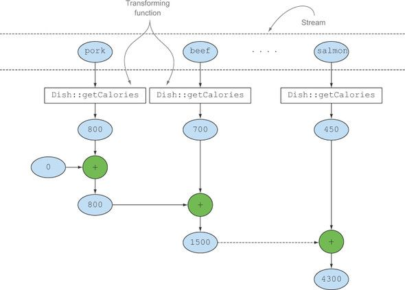

# 자바 8 인 액션

## \#6 스트림으로 데이터 수집

#### 1. 컬렉터란 무엇인가?
- 함수형 프로그래밍에서는 `무엇`을 원하는지 직접 명시할 수 있어서 어떤 방법으로 이를 얻을지는 신경 쓸 필요가 없다.
- Collector 인터페이스 구현은 스트림의 요소를 어떤식으로 도출하는지 지정한다.
- 다수준으로 그룹화를 수행할 때 차이점이 더욱 두드러진다.

##### 1.1 고급 리듀싱 기능을 수행하는 컬렉터
- 스트림에 collect를 호출하면 스트림의 요소에 리듀싱 연산이 수행한다.
- 리듀싱 연산을 이용해서 스트림의 각 요소를 방문하면서 컬렉터가 작업을 처리한다.
- Collector 인터페이스의 메서드르 어떻게 구현하느냐에 따라 스트림에 어떤 리듀싱 연산을 수행할지 결정된다.


##### 1.2 미리 정의된 컬렉터
- Collections에서 제공하는 메서드의 기능은 크게 세가지
  - 스트림 요소를 하나의 값으로 리듀스하고 요약
    - 다양한 계산을 수행할 때 유용하게 활용
  - 요소 그룹화
    - 다수준으로 그룹화 하거나 각각의 결과 서브 그룹에 추가로 리듀싱 연산을 적용할 수 있다.
  - 요소 분할


#### 2 리듀싱과 요약
- 컬렉터로 스트림의 모든 항목을 하나의 결과로 합칠 수 있다. (최종 연산)
- 예제 : `counting()`이라는 팩토리 메서드가 반환되는 컬렉터로 요리 수를 계산

```java
long howManyDishes = menu.stream().collect(Collectors.counting());
// 다음과 같이 생략 가능
howManyDishes = menu.stream().count();
```

##### 2.1 스트림 값에서 최대값과 최소값 검색
- Collectors.maxBy, Collectors.minBy 두개의 메서드를 이용하여 최대 값, 최소 값을 구할 수 있다.

```java
Comparator<Dish> disCaloriesComparator =
            Comparator.comparingInt(Dish::getCalories);

Optional<Dish> mostCalorieDish =
            menu.stream().collect(maxBy(disCaloriesComparator));
```
- Optional의 역할 : menu가 비어 있다면 어떤 요리도 반환하지 않을 것이다. 그래서 값을 포함하거나 포함하지 않을 수 있는 컨테이너 Optional을 사용 하였다.

##### 2.2 요약 연산
- 숫자 필드의 합계나 평균 등을 반환하는 연산

```java
// summingInt의 인수로 전달된 함수는 객체를 int로 매핑한 컬렉션을 반환한다.
// 그리고 summingInt가 collect 메서드로 전달되면 요약작업을 수행한다.
// 초기값이 0으로 설정
// Collectors.summingLong과 Collectors.summingDouble도 summingInt와 같은방식으로 동작
int totalCalories = menu.stream().collect(summingInt(Dish::getCalories));
```



```java
// 평균을 구할때는 Collectors.averagingInt, averagingDouble, averagingLong 등으로 계산할 수있다.
double averageCalories =
            menu.stream().collect(averagingInt(Dish::getCalories));
```

```java
// 두개 이상의 연산을 한번에 수행해야 할 경우 summarizingInt가 반환하는 컬렉터를 사용할 수 있다.
IntSummaryStatistics menuStatistics =
            menu.stream().collect(summarizingInt(Dish::getCalories));
```

##### 2.3 문자열 연결
- 컬렉터에 joining 팩토리 메서드를 이용하면 각 객체에 toString 메서드를 호출해서 문자열을 하나의 문자열로 연결하여 반환한다.

```java
String shortMenu = menu.stream().map(Dish::getName).collect(joining());
```
- Dish의 toString메서드를 요리명이 반환하도록 하면 map과정을 생략할 수 있다.

```java
String shortMenu = menu.stream().collect(joining());
```

```java
// 두 요소 사이에 구분 문자열을 넣을 수 있도록 오버로드된 joining 팩토리 메서드
String shortMenu = menu.stream().map(Dish::getName).collect(joining(", "));
```

##### 2.4 범용 리듀싱 요약 연산
- 지금까지 살펴본 모든 컬렉터는 reducing 팩토리 메서드로도 정의할 수 있다.

```java
// totalCalories 예제
// 첫번째 인수는 리듀싱 연산의 시작 값이거나 인수가 없을 때는 반환 값
// 두번째 인수는 변환 함수
// 세번째 인수는 두 항목을 하나의 값으로 더하는 BinaryOperator
int totalCalories =
    menu.stream().collect(reducing(0, Dish::getCalories, (i, j) -> i + j));

// 한 개의 인수를 가진 reducing 버전을 이용하는 방법
// 초기값이 없으므로 Optional을 반환
Optional<Dish> mostCalorieDish =
        menu.stream().collect(reducing((d1, d2) -> d1.getCalories() > d2.getCalories() ? d1 : d2));
```

##### 컬랙션 프로엠워크 유연성 : 같은 연산도 다양한 방식으로 수행할 수 있다!
- 람다식 대신 메서드 레퍼런스를 이용하면 코드를 더 단순화할 수 있다.

```java
int totalCalories =
    menu.stream().collect(reducing(0, Dish::getCalories, Integer::sum));
```


- 컬랙터를 이용하지 않고 다른방법 으로 같은 연산을 수행할 수 있음

```java
// 리듀스를 이용한 방법
//빈 스트림과 관련된 널 문제를 피할 수 있도록 int가 아닌 Optional<Integer>를 반환
// get()을 이용해 Optional 객체 내부의 값을 얻을 수 있다.
int totalCalories =
    menu.stream().map(Dish::getCalories).reduce(Integer::sum).get();
```

```java
// IntStream으로 매핑한 다음 sum 메서드를 호출하는 방법
int totalCalories = menu.stream().mapToInt(Dish::getCalories).sum();
```

##### 자신의 상황에 맞는 최적의 해법 선택
- 가독성과 성능에 맞는 해결책을 고르는 것이 바람직하다.
- 마지막예제인 IntStream을 이용한 해결방법이 가독성이 가장 좋고 간결하다.
- IntStream 덕분에 자동 언박싱 연산을 수행하거나 Integer를 int로 변환하는 과정을 피하여 성능까지 좋다.


#### 3. 그룹화
- 데이터 집합을 하나 이상의 특성으로 분류해서 그룹화하는 연산도 데이터 베이스에서 많이 수행되는 작업이다.
- 명령형으로 그룹화를 구현하려면 까다롭고 할일이 많으며 에러도 많이 발생한다.
- 함수형을 이용하면 가독성 있는 한줄의 코드로 그룹화를 구현할 수 있다.

```java
// 각 요리에서 Type이 일치하는 모든요리를 추출, groupingBy 메서드를 이용
// groupingBy에 전달된 함수 기준으로 스트림이 그룹화 되므로 이를 '분류함수'라고 부른다.
Map<Dish.Type, List<Dish>> dishesByType =
      menu.stream().collect(groupingBy(Dish::getType));
```


- 더욱 복잡한 분류 기준이 필요한 상황에서는 메서드 레퍼런스를 분류 함수로 이용할 수 없다.
- 메서드 레퍼런스 대신 람다 표현식으로 필요한 로직을 구현할 수 있다.

```java
public enum CaloricLevel {
    DIET, NORMAL, FAT
}
```
```java
// 각 요리를 칼로리 기준별로 분류
Map<CaloricLevel, List<Dish>> dishesByCaloricLevel = menu.stream().collect(
    groupingBy(dish -> {
        if(dish.getCalories() <= 400) {
            return CaloricLevel.DIET;
        } else if(dish.getCalories() <= 700) {
            return CaloricLevel.NORMAL;
        } else {
            return CaloricLevel.FAT;
        }
}));
```

##### 3.1 다수준 그룹화
- 두 인수(함수와 컬렉터)를 받는 팩토리 메서드 groupingBy를 이용해서 항목을 다수준으로 그룹화할 수있다.
- 두번째 기준(컬랙터)을 정의하는 내부 groupingBy를 전달해서 두수준으로 스트림의 항복을 그룹화할 수 있다.

```java
Map<Dish.Type, Map<CaloricLevel, List<Dish>>> dishesByTypeCaloricLevel =
    menu.stream().collect(groupingBy(Dish::getType,
        groupingBy(dish -> {
            if (dish.getCalories() <= 400) {
                return CaloricLevel.DIET;
            } else if (dish.getCalories() <= 700) {
                return CaloricLevel.NORMAL;
            } else {
                return CaloricLevel.FAT;
            }
        })
));
```
- 보통 groupingBy의 연산을 버킷 개념으로 생각
- 첫번째 groupingBy는 각 키의 버킷을 만들고 준비된 각각의 버킷을 서브스트림 컬렉터로 채워가기를 반복하면서 n수준의 그룹화를 만든다.


##### 3.2 서브그룹으로 데이터 수집
- groupingBy에서 컬렉터의 형식은 제한이 없다.
- groupingBy(f)는 사실 groupingBy(f, toList())의 축양형이다.

```java
Map<Dish.Type, Long> types =
    menu.stream().collect(groupingBy(Dish::getType, counting()));
```

```java
// 종류별 가장 높은 칼로리 음식 추출 예제
Map<Dish.Type, Optional<Dish>> mostCaloricByType =
    menu.stream().collect(groupingBy(Dish::getType, maxBy(comparingInt(Dish::getCalories))));
```

##### 컬랙터 결과를 다른 형식에 적용하기
- 마지막 그룹화 연산에서 맵을 모든값을 Optional로 감쌀 필요가 없으므로 Optional을 삭제할 수 있다.
- Collectors.collectingAndThen으로 컬렉터가 반환한 결과를 다른 형식으로 활용할 수 있다.

```java
Map<Dish.Type, Dish> mostCaloricByType =
    menu.stream().collect(groupingBy(Dish::getType,
            collectingAndThen(maxBy(comparingInt(Dish::getCalories)), Optional::get)
    ));
```


#### 4. 분할
- 분할 함수라 불리는 프레디케이트를 분류 함수로 사용하는 특수한 그룹화 기능
- 맵의 키 형식은 Boolean 이다.
- 최대 두 개의 그룹으로 분류된다.

```java
Map<Boolean, List<Dish>> partitionedMenu =
      menu.stream().collect(partitioningBy(Dish::isVegetarian));
List<Dish> vagetarianDishes = partitionedMenu.get(true);

// filter를 이용해도 같은 값이 나온다.
List<Dish> vagetarianDishes =
      menu.stream().filter(Dish::isVegetarian).collect(toList());
```

###### 4.1 분할의 장점
- 참, 거짓 두 가지 요소의 스트림 리스트를 모두 유지한다는 것이 분할의 장점

```java
Map<Boolean, Map<Dish.Type, List<Dish>>> vegtarianDishesByType =
        menu.stream().collect(partitioningBy(Dish::isVegetarian, groupingBy(Dish::getType)));

Map<Boolean, Dish> mostCaloricPartitionedByVegtarian =
        menu.stream().collect(partitioningBy(Dish::isVegetarian,
                collectingAndThen(maxBy(Comparator.comparingInt(Dish::getCalories)), Optional::get)));
```

###### 4.2 숫자를 소수와 비소수로 분할하기


#### 5. Collector 인터페이스
-

```java
// Collector 인터페이스
public interface Collector<T, A, R> {
  Supplier<A> supplier();
  BiConsumer<A, T> accumulator();
  Function<A, R> finisher();
  BinaryOperator<A> combiner();
  Set<Characteristics> characteristics();
}
```
- T 는 수집될 스트림 항목의 제네릭 형태
- A 는 누적자. 즉 수집 과정에서 중간 결과를 누적하는 객체의 형태
- R 은 수집 연산 결과의 형식


#### 6. 커스텀 컬렉터를 구현해서 성능 개선하기
