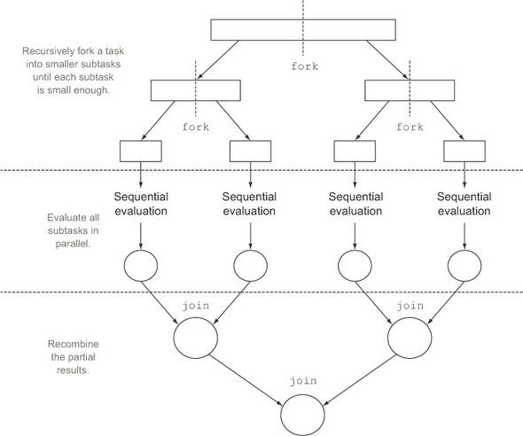
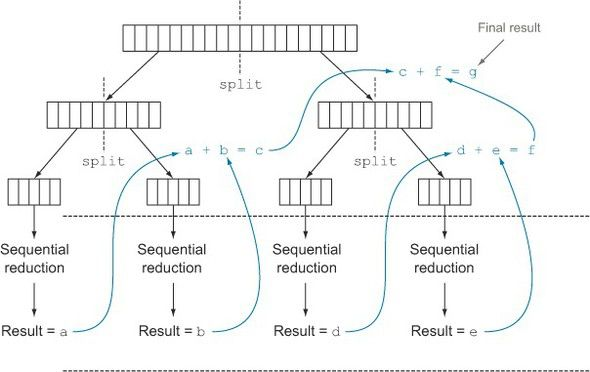
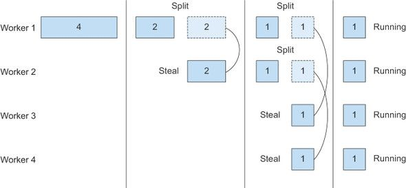

# 자바 8 인 액션

## \#7 병렬 데이터 처리와 성능

- 자바 7에서 병렬 처리를 하기 위해선 스레드를 이용해야 했지만 오류가 많이 발생하고 동기화도 신경 써줘야한다.
- 자바 7에서 병렬화 수행하면서 에러를 최소화 하기 위해서 포크/조인 프레임 워크를 제공한다.
- 스트림으로 데이터 컬렉션 관련 동작을 쉽게 병렬로 실행할 수 있다.

#### 1. 병렬 스트림
- 컬렉션에 parallelStream을 호출하면 병렬 스트림이 생성된다.
- 병렬 스트림은 각각의 스레드에서 처리할 수 있도록 스트림 요소를 청크로 분할한 스트림이다.

```java
// 1부터 n까지의 모든 숫자의 합계를 반환하는 메서드
public static long sequntialSum(long n) {
  return Stream.iterate(1L, i -> i + 1)
                .limit(n)
                .reduce(0L, Long::sum); // BinaryOperator로 리듀싱
}
```

```java
// java 7 이전 스타일
public static long iteraticeSum(long n) {
  long result = 0;
  for (long i = 1L; i <= n; i++) {
    result += i;
  }

  return result;
}
```
- n이 커진다면 연산을 병렬로 처리하는 것이 좋을 것이다.

##### 1.1 순차 스트림을 병렬 스트림으로 변환하기
- 순차 스트림에 `parallel()` 메서드를 호출하면 기존의 함수형 리듀싱 연산이 병렬로 처리

```java
public static long parallelSum(long n) {
    return Stream.iterate(1L, i -> i + 1)
                .limit(n)
                .parallel()
                .reduce(0L, Long::sum);
}
```

- 병렬 스트림에 `sequntial()` 메서드를 이용해 순차 스트림으로 바꿀 수 있다.
- `parallel()`과 `sequntial()` 메서드를 이용해서 어떤 연산은 병렬로 어떤 연산은 순차로 실행하도록 제어할 수 있다.

##### 1.2 스트림 성능 측정
- 병렬화를 하면 순차나 반복 형식에 비해 성능이 좋아질꺼라 추축했다.

```java
// n개의 숫자를 더하는 함수의 성능 측정
public long measureSumPerf(Function<Long, Long> adder, long n) {
  long fastest = Long.MAX_VALUE;
  for (int i = 0; i < 10; i++) {
    long start = System.nanoTime();
    long sum = adder.apply(n);
    long duration = (System.nanoTime() - start) / 1_000_000;
    System.out.println("Result : " + sum);
    if (duration < fastest) fastest = duration;
  }
}

public static void main(String[] arg) {
  // Sequential sum done is : 1355 msecs
  System.out.println("Sequential sum done is : " + measureSumPerf(ParallelStreams::sequentialSum, 100_000_000) + " msecs");
  // Iterative sum done is : 34 msecs
  System.out.println("Iterative sum done is : " + measureSumPerf(ParallelStreams::iterativeSum, 100_000_000) + " msecs");
  // Parallel sum done is : 7874 msecs
  System.out.println("Parallel sum done is : " + measureSumPerf(ParallelStreams::parallelSum, 100_000_000) + " msecs");
}
```
- 하지만 병렬버전이 느리게 동작한다.. 왜일까?
  - for 루프는 저수준으로 동작하며 기본 값을 박싱, 언박싱할 필요가 없어 수행속도가 빠르다.
  - iterate가 박싱된 객체를 생성하므로 언박싱하는 과정이 필요했다.
  - iterate는 병렬로 실행될 수 있도록 독립적인 정크로 분할 하기 어렵다.

##### 더 특화된 메서드
- 멀티코어 프로세서를 활용해서 효과적으로 합계 연산을 병렬로 실행하려면 어떻게 해야할까?
  - LongStream.rangeClosed는 long을 직접 사용하므로 박싱과 언박싱 오버헤드가 사라진다.
  - LongStream.rangeClosed는 쉽게 청크로 분할할 수 있는 순자 범위를 생산한다.

```java
public static long rangedSum(long n) {
    return LongStream.rangeClosed(1, n).reduce(Long::sum).getAsLong();
}

public static long parallelRangedSum(long n) {
    return LongStream.rangeClosed(1, n).parallel().reduce(Long::sum).getAsLong();
}

// Ranged sum done in : 12 msecs
System.out.println("Ranged sum done in : " + measureSumPerf(ParallelStreams::rangedSum, 10_000_000));
// ParallelRangedSum sum done in : 3 msecs
System.out.println("Parallel ranged sum done in : " + measureSumPerf(ParallelStreams::parallelRangedSum, 10_000_000));
```
- 상황에 따라서는 어떤 알고리즘을 병렬화하는 것보다, 적절한 자료구조를 선택하는 것이 더 중요하다는 사실을 단적으로 보여준다.
- 병렬화를 이용하려면 스트림을 재귀적으로 분할 해야하고 각 서브 스트림을 서로 다른 스레드의 리듀싱 연산으로 할당하고, 이들 결과를 하나의 값으로 합쳐야 한다.

##### 1.3 병렬 스트림의 올바른 사용법
- 병렬 스트림을 잘못 사용하면서 발생하는 문제는 공유된 상태를 바꾼느 알고리즘을 하기 때문에 일어난다.

```java
// n까지 자연수를 더하면서 공유된 누적자를 바꾸는 메서드
public static long sideEffectSum(long n) {
    Accumulator accumulator = new Accumulator();
    LongStream.rangeClosed(1, n).forEach(accumulator::add);
    return accumulator.total;
}

public static class Accumulator {
    private long total = 0;

    public void add(long value) {
        total += value;
    }
}
```
- 순차적으로 실행할 수 있도록 구연되어 있으므로 병렬로 접근하면 데이터 레이스 문제가 일어난다.

```java
// 병렬로 실행시 올바른 값이 나오지 않는다.
public static long sideEffectParallelSum(long n) {
    Accumulator accumulator = new Accumulator();
    LongStream.rangeClosed(1, n).parallel().forEach(accumulator::add);
    return accumulator.total;
}
```
- 병렬 스트림과 병렬 계산에서는 공유된 가변 상태를 피해야한다.

##### 1.4 병렬 스트림 효과적으로 사용하기
- 확신이 서지 않다면 직접 측정하라
  - 순차스트림이나 병렬스트림 둘중 어떤 것이 좋을지 모르겠다면 벤치마크로 직접 성능을 측정하는 것이 바람직하다.
- 박싱을 주의하라
  - 자동 박싱과 언박싱은 성능을 크게 저하시킬 수 있는 요소다.
  - 박싱 동작을 피할 수 있도록 기본형 특화 스트림을 제공한다.
- 순차 스트림보다 병렬 스트림에서 성능이 떨어지는 연산이 있다.
  - limit나 findFirst같은 순서에 의존하는 연산을 병렬 스트림에 사용하려면 비싼 비용을 치뤄야한다.
- 스트림에서 수행하는 전체 파이프라인 연산 비용을 고려하라
  - 처리하는 비용이 높다는 것은 병렬 스트림으로 성능을 개선할 수 있는 가능성이 있음을 의미한다.
- 소량의 데이터에서는 병렬 스트림이 도움 되지 않는다.
- 스트림을 구성하는 자료구조가 적절한지 확인하라.
- 스트림의 특성과 파이프라인의 중간 연산이 스트림의 특성을 어떻게 바꾸는지에 따라 분해과정의 성능이 달라질 수 있다.
- 최종 연산의 병합과정 비용을 살펴보라.
  - 병렬 스트림으로 얻은 성능의 이익을 부분결과를 합치는 과정에서 상쇄될 수 있다.


#### 2. 포크/조인 프레임워크
- 병렬화 할 수 있는 작업을 재위적으로 작은 작업으로 분할한 다음에 서브태스크 각각의 결과를 합쳐서 전체 결과를 만들도록 설계되었다.

##### 2.1 RecursiveTask 활용
- 스레드 풀을 이용하려면 RecursiveTask<R>의 서브클래스를 만들어야 한다.
- RecursiveTask를 정의하려면 추상 메서드 compute를 구현해야한다.
```java
protected abstract R compute();
```

- compute 메서드는 태스크를 서브태스크로 분할하는 로직과 더이상 분할할 수 없을때 개별 서브테스크의 결과를 생산할 알고리즘을 정의한다.

```java
// 분할 후 정복 (divide and conquer) 알고리즘 병렬화 버전
if (태스크가 충분히 작거나 분할할 수 없으면) {
  순차적으로 태스크 계산
} else {
  태스크를 두 서브 태스크로 분할
  태스크가 다시 서브태스크로 분할 되도록 이 메서드를 재귀적으로 호출
  모든 서브 태스크의 연산이 완료될 때까지 기다림
  각 서브 태스크의 결과를 합침
}
```



```java
// n까지의 자연수를 덧셈 작업을 병렬로 수행하는 클래스
public class ForkJoinSumCalculator extends RecursiveTask<Long>{

    // 더할 숫자 배열
    private final long[] numbers;

    // 이 서브태스크에서 처리할 배열의 초기 위치와 최종 위치
    private final int start;
    private final int end;
    private static final long THRESHOLE = 10_000;

    // 메인 테스크용 공개 생성자
    public ForkJoinSumCalculator(long[] numbers) {
        this(numbers, 0, numbers.length);
    }

    // 서브 태스크용 비공개 생성자
    public ForkJoinSumCalculator(long[] numbers, int start, int end) {
        this.numbers = numbers;
        this.start = start;
        this.end = end;
    }

    @Override
    protected Long compute() {
        // 테스크에서 더할 배열의 크기
        int length = end - start;

        if(length <= THRESHOLE) {
            // 기준 값과 같거나 작으면 순차적으로 결과를 계산
            return computeSequentially();
        }

        // 배열의 첫번째 절반을 더하도록 서브태스크를 생성한다.
        ForkJoinSumCalculator leftTask = new ForkJoinSumCalculator(numbers, start, start + length / 2);
        // ForkJoinPool의 다른스레드로 새로 생성한 테스크를 비동기로 실행한다.
        leftTask.fork();

        // 나머지 절반을 더하도록 서브태스크를 생성한다.
        ForkJoinSumCalculator rightTask = new ForkJoinSumCalculator(numbers, start + length / 2, end);
        // 두번째 서브태스크를 동기 실행한다. (재귀)
        Long rightResult = rightTask.compute();

        // 첫번째 서브태스크의 결과를 읽거나 결과를 기다린디.
        Long leftResult = leftTask.join();

        return leftResult + rightResult;
    }

    private long computeSequentially() {
        long sum = 0;
        for(int i = start; i < end; i++) {
            sum += numbers[i];
        }

        return sum;
    }

}
```

- ForkJoinSumCalculator 실행
```java
// 병렬 스트림을 이용할 때보다 성능이 나빠졌다.
// ForkJoinSumCalculator 태스크에서 사용할 수 있도록 전체 스트림을 long[]으로 변환했기 때문
public static long forkJoinSum(long n) {
      long[] numbers = LongStream.rangeClosed(1, n).toArray();
      ForkJoinTask task = new ForkJoinSumCalculator(numbers);

      return new ForkJoinPool().invoke(task);
}
```



##### 2.2 포크/조인 프레임워크 제대로 사용하는 방법
- join 메서드를 태스크에 호출하면 태스크가 생산하는 결과가 준비될 때까지 호출자를 블록 시킨다.
  - 두 서브 태스크가 모두 시작된 다음에 join을 호출해야 한다.
- RecursiveTask 내에서는 ForkJoinPool의 invoke 메서드를 사용하지 말아야한다.
  - 순차코드에서 병렬 계산을 시작할 대만 invoke 사용
- 서브 태스크에 fork 메서드를 호출해서 ForkJoinPool의 일정을 조절할 수 있다.
- 포크/조인 프레임워크를 이용하는 병렬 계산은 디버깅하기 어렵다.
- 포크/조인 프레임워크를 사용하는 것이 순차 처리보다 무조건 빠를 거라는 생각은 버려야한다.

##### 2.3 작업 훔치기
- 작업 훔치기 기법에서는 모든 스레드를 거의 공정하게 분할한다.
- 각각의 스레드는 자신에게 할당된 태스크를 포함하는 이중 연결 리스트를 참조함녀서 작업이 끝날때마다 큐의 헤드에서 다른 태스크를 가져와서 작업을 처리한다.
- 할일이 없어진 스레드는 유휴 상태로 바뀌는 것이 아니라 다른 스레드 큐의 꼬리에서 작업을 훔쳐온다.
- 모든 태스크가 작업을 끝낼때까지 반복한다.





#### 3. Spliterator
- 분할할 수 있는 반복자라는 의미
- Iterator처럼 탐색 기능을 제공 하지만, 병렬 작업에 특화 되어있다.

```java
public interface Spliterator<T> {
  boolean tryAdvance(Consumer<? super T> action);
  Spliterator<T> trySplit();
  long estimateSize();
  int characteristics();
}
```
